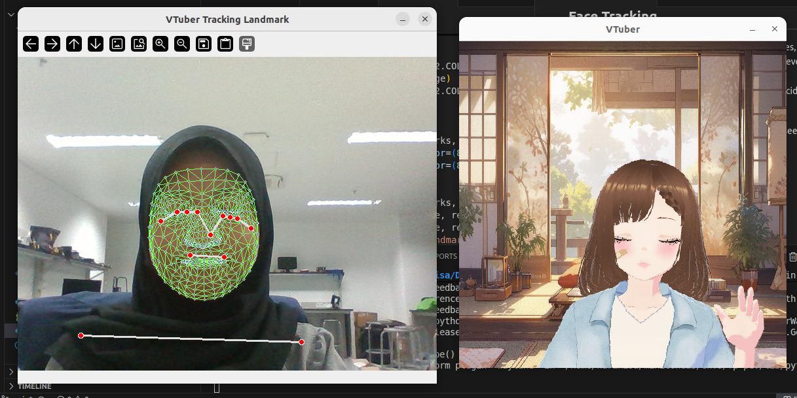
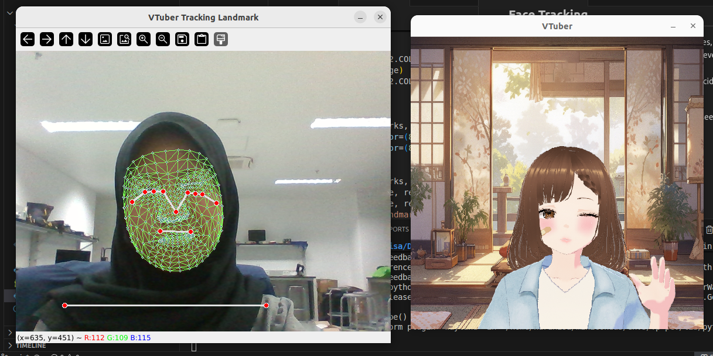
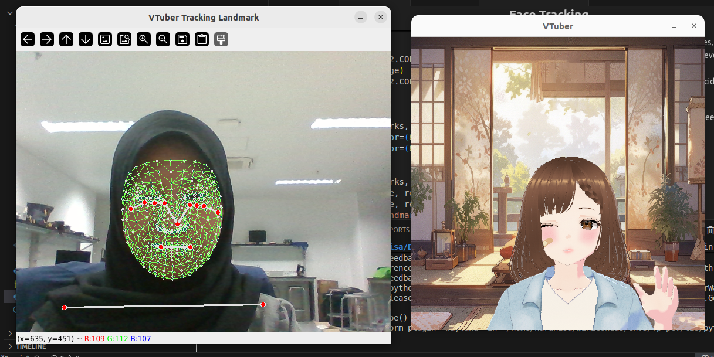
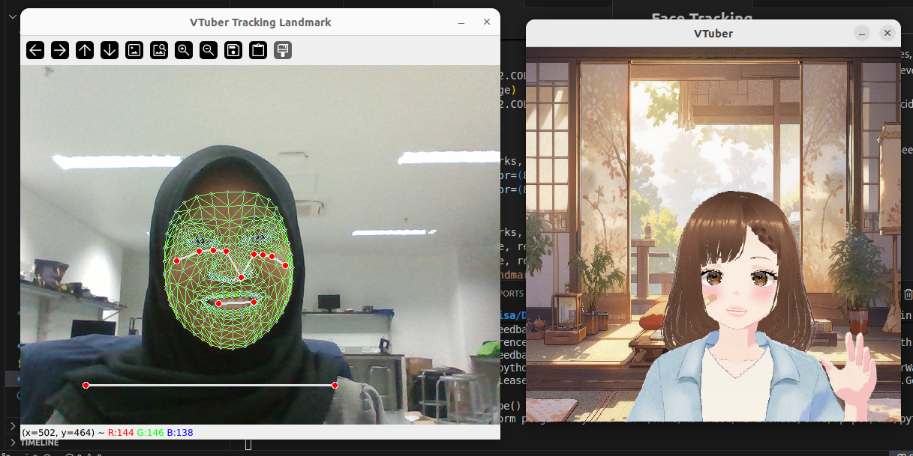
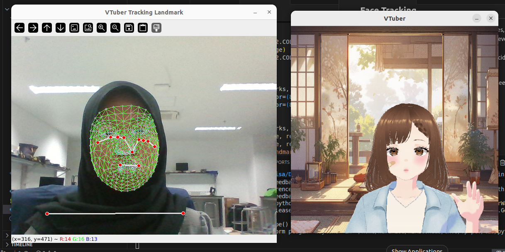
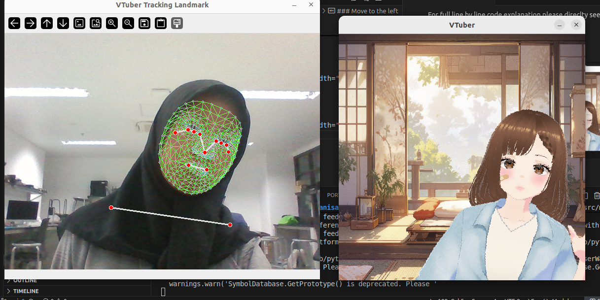
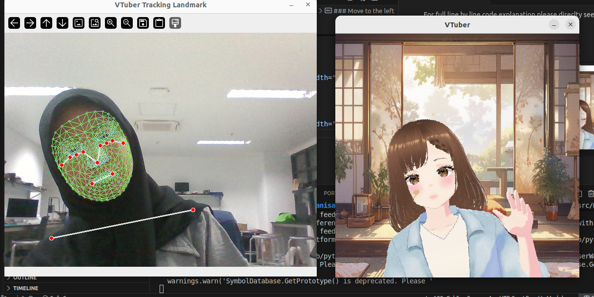
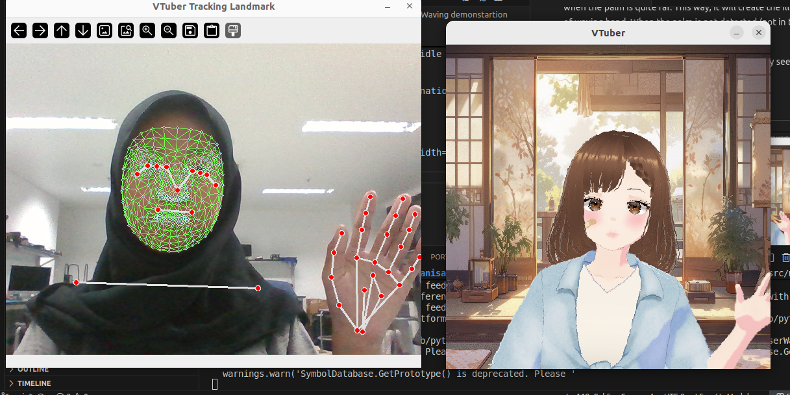
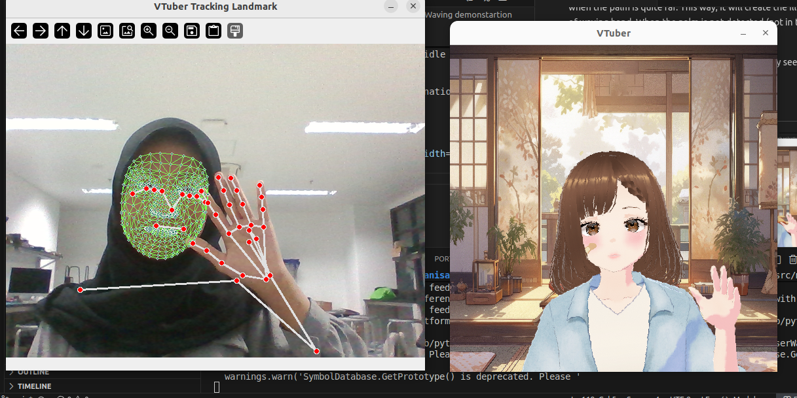

# 2D VTuber Creative Project


PyGame based 2D VTuber Application 
using Holictic Solution from MediaPipe for Pose Tracking

**Main Feature** 
1. Face Tracking  
2. Body Movement Tracking
3. Waving Gesture

more explanation and application see [below](#features-explanation)

# Table of Contents
- [Instalation](#instalation)
- [Project Structure](#project-structure)
- [Features Explanation](#features-explanation)
    - [Overview](#overview-ofthe-technology-used)
    - [Face Tracking](#face-tracking)
    - [Body Movement Tracking](#body-movement-tracking)
    - [Waving Gesture](#waving-gesture)


# Instalation
1. Clone project in your local computer
```sh
git clone https://github.com/anisamsrh/PCV-landmarking-project
```
2. Create conda environment for the project
```sh
conda env create -f environment.yml
```
or install manually. Make sure to use the supported version of python. This project uses 3.11.xx
```sh
pip install opencv-python mediapipe numpy
```
3. Run the application
```sh
cd PCV-landmarking-project
python3 main.py
```
if you want to only see the landmarking, run this instead
```sh
python3 landmarking.py
```

# Project Structure
The structure of the project is as below
```
.
├── assets              # assets for README
├── environment.yml
├── landmarking.py
├── LICENSE
├── README.MD
└── src
    ├── assets          # assets for the app
    │   ├── v1
    │   ├── v2
    │   └── v3
    ├── main.py
    └── utils           # utility modules
        ├── blit_rotate.py
        ├── get_angle_diff.py
        ├── get_body_rotation.py
        ├── get_dist.py
        └── __init__.py

```

# Features Explanation
## Overview ofThe Technology Used
VTuber or Virtual Youtuber is an online persona commonly a streamer based in Youtube that is using characters of anykind to represent its identity instead of a person. In term on Computer Vision, the technology used in this trend is an exploration of pose tracking and landmarking that is as far interesting to explore. With the advancement of technology, tools like python with millions packages are available to use that are enough for educational purposes. Thus, this project will explore the computer vision side of VTuber techology using one of the most known python framework, MediaPipe.

In this case, Holistic Solution will be used because it provides all the models for pose, face and hand landmarking. For visual data aquisition, opencv will be in charge while also doing preprocessing, especially for converting camera input that used BGR to RGB used by MediaPipe. Last but not least, PyGame will do the visual rendering to load the avatar to the screen.

## Face Tracking

In this project, the avatar will mimic user face gestures, including blinking, winking, and speaking. This is achieved by tracking user face nodes of the eyes and mouth then computing the movement based on the tresholds decided before. 

For full line by line code explanation please direclty see each file.

### Blinking
<p align="center">
  
</p>

### Winking Right
<p align="center">
  
</p>

### Winking Left
<p align="center">
  
</p>

### Say A
<p align="center">
  
</p>

### Say E/I
<p align="center">
  
</p>

### Say U/O
<p align="center">
  
</p>

## Body Movement Tracking

In order to make the avatar movement feels more fluid, body tracking is implemented. The aim is simple, avatar will move to the right or to the left as the body moves. To do this, the code will calculate the angle created by the shoulder's nodes. Later,  the nose node the be used to determine where to draw the assets.

For full line by line code explanation please direclty see each file.

### Move to the right
<p align="center">
  
</p>

### Move to the left
<p align="center">
  
</p>

## Waving Gesture
VTubers interacts with their audiens as natural as human do. Thus, the ability to show some gesture is beneficiary to create more intimate interactions. Waving is one of the common things people do to each other, thus this project will inlcude waving as its first gesture feature. This feature will take advantage of the distance between shoulder node and palm node whereas when the palm is near enough to the shoulder, it will show assets with such visual, and the same when the palm is quite far. This way, it will create the illusion of waving hand. When the palm is not detected (not in the frame), an idle body will be shown instead.

For full line by line code explanation please direclty see each file.

### Waving demonstartion
<p align="center">
  
</p>
<p align="center">
  
</p>